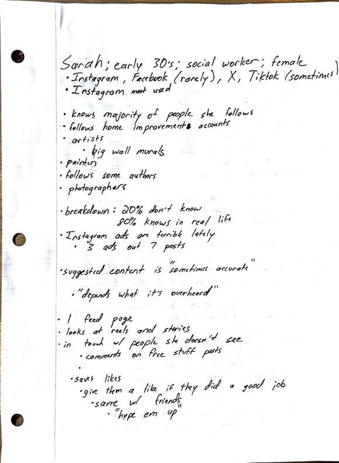
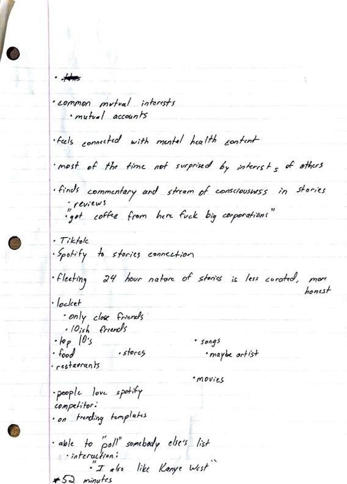
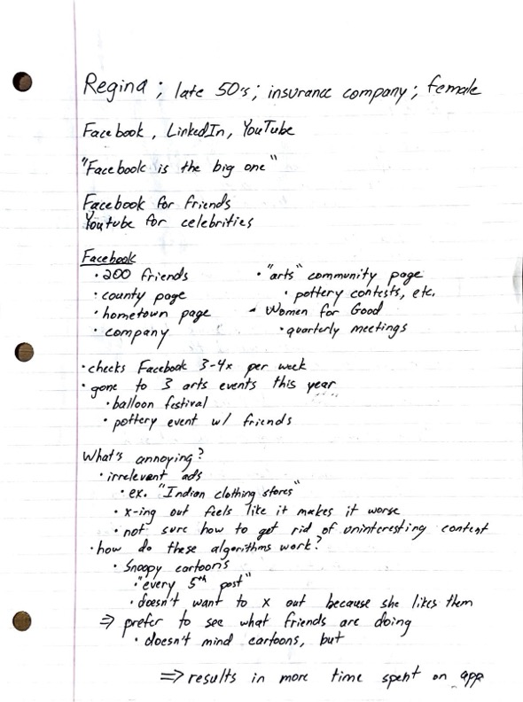
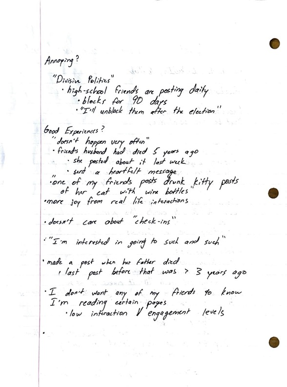
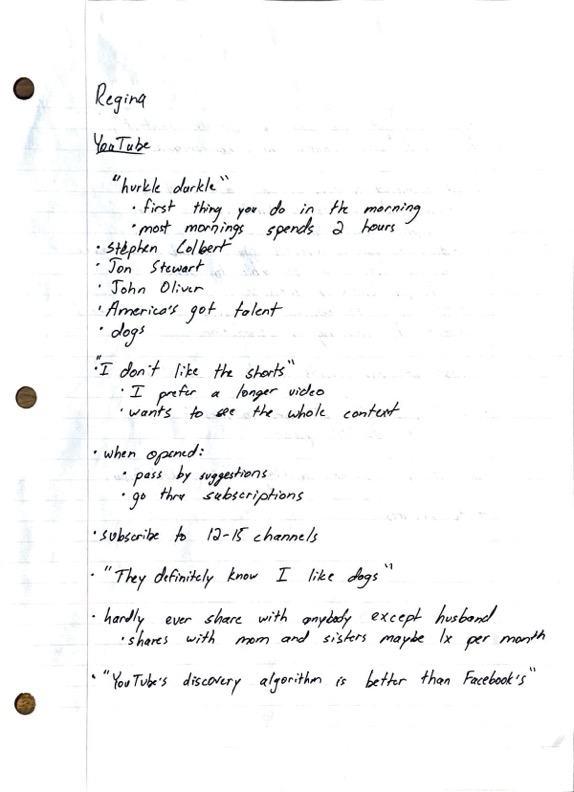
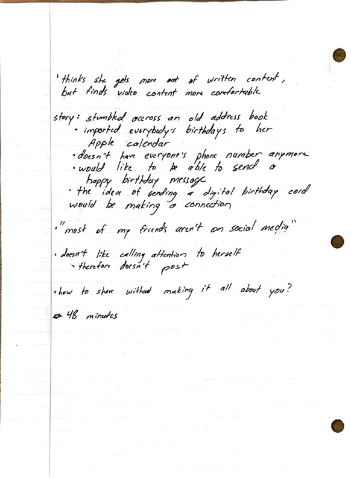
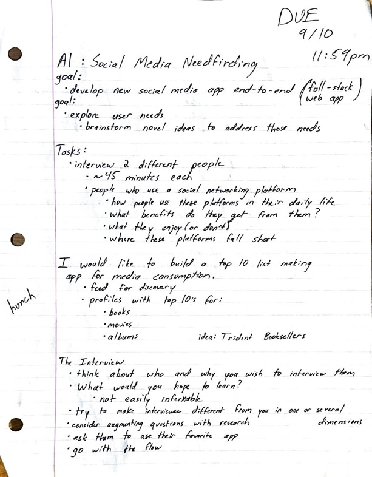

# Assignment 1

## Sarah's Interview  
Sarah's social networking platform of choice is Instagram, although she also uses X Facebook, and TikTok from time to time. Sarah's biggest source of dopamine hits comes from sharing relatable content, or "pebbling", with her friends and family. She enjoys dark humor and meme accounts, and will share a post with anyone in her life she thinks will respond with "haha relatable". Sarah finds personal motivation from many of the Instagram accounts she follows. She sees this as a primary benefit -- adopting ideas from home improvement pages and from various other sources of DIY inspiration.

I found it surprising that Sarah only posts on Instagram around twice per year, because she seemed very outgoing and sociable. When asked, she stated that she liked to be mysterious and thought a lot potential shareables were "not post-worthy". Interestingly, she will post Instagram stories more willingly to a "close friends list". Her official page, though, is reserved for the more curated content like events with friends and family and pictures of her dog. She says, "nobody wants to see a picture of my toes and Harry Potter on the TV." Sarah expressed frustration with the amount of irrelevant content, especially ads, in her feed. She's cut back on her social media usage as a result of the influx of sponsored content. She yearns for fewer bots, fakes, and ads, and sees the latest iteration of Instagram as a space that's less social and connective, and more as one that's built to pursue monetary goals.

## Regina's Interview  
Regina's primary social networking platform is Facebook. However, she will spend even more time (2 hours every morning) on YouTube watching dog videos and her favorite celebrities -- a time period she calls her "hurkle durkle". Regina values the connective abilities of Facebook as it enables her to connect with her local arts community, her hometown, and her local county's page -- among other things. Her favorite Facebook content comes in the form of "drunk kitty posts", where her friend captures her cat posing in different positions with a bottle of wine.

She remarks that good experiences don't happen very often, but feels a sense of obligation to stay connected somehow. She's only posted twice in the last 3 years, and doesn't want her friends to know what sort of content she consumes, so she rarely engages with posts unless it's a friend's major life event. She laments "divisive politics" from her high school friends, and has gone as far as to block their posts for 90 days. "I'll unblock them after the election", she assured me.

## Design Opportunities  
+ I want to explore giving users the opportunity to post and engage without feeling like the center of attention. Both of my interviewees felt reserved about posting on their favorite social media platforms because they felt like they would be making it all about them.  Sarah posts on average 2 times per year while Regina has posted twice in the last 3 years.
+ I want to explore randomized content feeds. I think curated discovery algorithms can be either creepy or completely off base. I believe people find great satisfaction in stumbling upon something unexpected. I want to make space for curious and open-minded users to come across content they're totally unfamiliar with.
+ I'm interested in designing a user experience that gives total and complete power to the user. I think a settings page should have toggle and slider options for just about every available feature -- including the ability to turn a feature off completely. People vary significantly in their interests and interaction goals, and I think a social networking platform should reflect that diversity of use cases.

## Raw Interview Notes  

#### Sarah:

  

  

  

#### Regina:  

  

  

  

  

## Planning Materials  

  

  

  