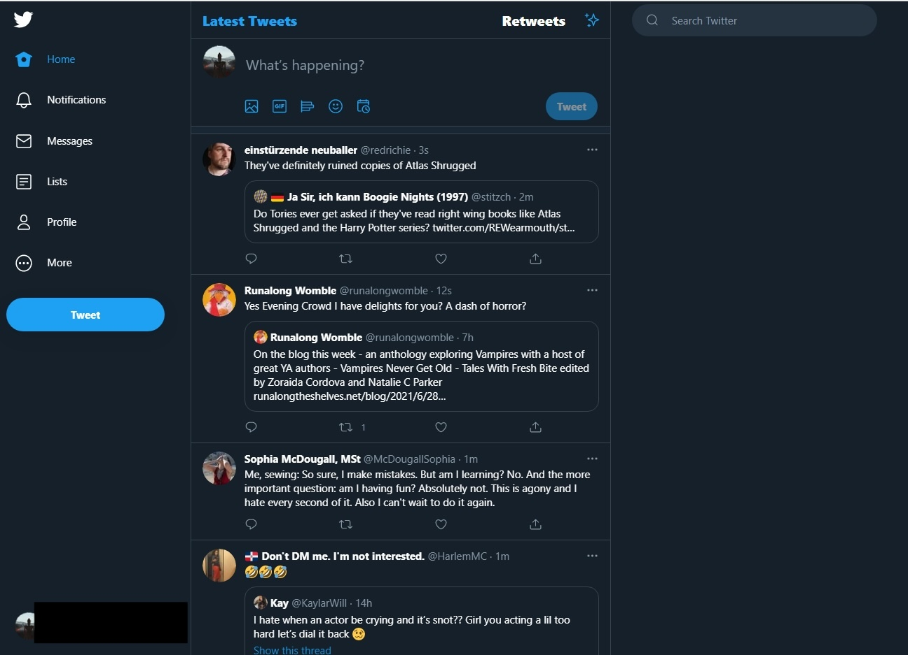

# Assignment 2

## Broad Application Goals
 
### Enny1

Enny is your personal entertainment encyclopedia. Humans have leaned on various sources of entertainment for millennia. We began with village elders sharing stories late at night around a fire, and now we're exploring the same principles of storytelling, imagination, and escapism through ever-advancing forms of technology. Relaxation by way of entertainment is so central to the human condition that the United Nations has declared that "everyone has the right to rest and leisure" in article 24 of the Universal Declaration of Human Rights (UDHR).

### Intended Audience:
While entertainment is universally appreciated, Enny is not for everybody. Enny is particularly intended for those who wish to document their entertainment escapades. It's for capturing your thoughts and feelings about a piece of entertainment immediately after consumption. Think of it as a digital log or diary for various media you enjoy in your free time. Not only is it useful for cataloging the media you've already enjoyed, it's for exploring what to enjoy next. Enny's for adventurous people who would like to discover a new movie, book, or album; and, beyond that, it's for connecting you with other people who would like to do the same.

### Value beyond existing apps:
Other apps allow you to rate and catalog various forms of media. What sets Enny apart is its difference in design principles. We believe in randomly stumbling upon something new. We won't try to curate your feed with "smart" discovery algorithms. We also believe in the power of autonomy. Every setting that we have to offer is toggle-able or adjustable. This puts the power of choice back in your hands. You decide what to watch, read, or listen to. 

1 fun name

## Scrapbook of Comparables

*In no particular order of importance:*

**Wikipedia's random article generator** -- here's a wonderful example of directing the user to content they may or may not enjoy.

**IMDB's watchlist** -- I love the concept of having a list of content you'd like to save for later.

**Twitter's timeline** -- life moves in a chronological order. Your content feed should move the same way

## Possible Features

*In no particular order of importance:*

+ **"Seems Entertaining" List**: units of entertainment that you'd like to consume one day

+ **"Consumed" List**: entertainment entries you've recorded in your digital diary

+ **Flashbacks**: while visiting your own profile you're able to jump back in time. A year, two years, a decade. Use flashbacks to see what kind of entertainment you were digging way back when.

+ **Tastemakers**: a set of users with particularly quirky or off-the-wall tastes. How we will evaluate who has interesting tastes is to be determined.

+ **The Timeline**: entertainment entries from other users, in chronological order. Includes the option to filter by friends only.

+ **Discovery**: search tool for finding your next kick

+ **Star Ratings**: novel(?) concept designed to allow the user to give an entertainment entry a number of stars depending on how much they enjoyed the content -- out of 10

+ **Tippity Top**: aggregated lists of top tens for each entertainment type; e.g. top 

+ **Stumble Upon**: Randomly takes you to an entertainment title

+ **Mood Tags**: discovery tool to filter by how you're feeling

+ **I have x amount of time to spare"**: filter entertainment units whether you have 20 minutes or an entire weekend

+ **Suggest to a friend**: when posting, you have the ability to share with a friend you think would particularly enjoy that entertainment entry

+ **"Show Common Interests" button**: when visiting another user's profile, check out which entertainment entries you have in common

+ **Social vs Solitary Tags**: filter for whether you'd like to spend time with others or by yourself

+ **Family Friendly Mode**: to include content the kids can enjoy

+ **Raunchy Mode**: for content you'd be embarrassed to consume in the company of your parents

+ **Profile Top Tens**: Clicking on a user's profile allows you to see their choice of top tens. Users can choose one or several of their favorite forms of entertainment along with their personal corresponding top ten list. Users can also opt out and display nothing at all.

## Value-Sensitive Design Analysis

*In no particular order of importance:*

1. **Non-targeted Use** 

While Enny is intended for content consumers, it could be used by nefarious actors who are hoping to artificially inflate their own content's ratings. Verification steps need to be taken in order to cut down on the number of bots and record labels. 

2. **Direct Stakeholders**

Families with young children may be using this app. We may include the option to filter based on family-friendly content. I'm torn on this feature because there are already several databases for checking the maturity rating of media.

3. **Variation in Human Ability**

Humans come with different abilities. We'll add accessibility features, like whether or not an audiobook is available for vision-impaired or if an audio transcription is available for a podcast.

4. **Reappropriation**

With Enny we're essentially reviewing a leisure experience. Leisure experiences change over time with respect to shifting technologies. We can allow for new media types by enabling create an entry features.

5. **Sustained Friendships**

People like to connect over mutual interests and by sharing entertainment reviews. We'll add connectivity tools like recommandation tags and shareable summaries (no spoilers!)

6. **Work of the Future**

It could be that our society finds an efficient way to financially reward information donation. Boom cash money via Enny.

hello good and gracious grader pls have mercy on my soul... I ran out of time for my values analysis writeup, but trust that I read through all prompts and have considered them on a deep level

## Storyboarding and Sketching

Flow #1: **posting a review**

Flow #2: **discovering something new**

