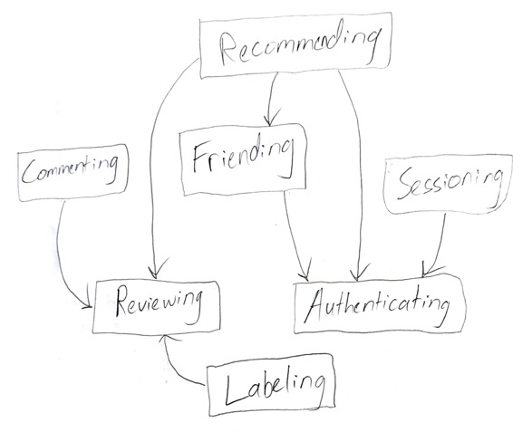

# Assignment 3

## Pitch

**Enny** is your personal entertainment encyclopedia. Humans have leaned on various sources of entertainment for millennia. We began with village elders sharing stories late at night around a fire, and now we're exploring the same principles of storytelling, imagination, and escapism through ever-advancing forms of technology. Relaxation by way of entertainment is so central to the human condition that the United Nations has declared that "everyone has the right to rest and leisure" in article 24 of the Universal Declaration of Human Rights (UDHR).

With **Enny**, you'll be able to give a star rating to a movie you just watched and then have the option to tag friends you think might also enjoy it. You can check in on that one friend with quirky tastes and see which albums they've been listening to lately. More than anything, **Enny** is a record of your sentiments detailing what's entertained you over the years. Did you read a book a decade ago that you really enjoyed but don't quite remember why? Using Enny as your digital diary allows you to reflect on how you felt immediately after consuming a unit of entertainment. 

While entertainment is universally appreciated, **Enny** is not for everybody. **Enny** is particularly intended for those who wish to document their entertainment escapades. It's for capturing your thoughts and feelings about a unit of entertainment immediately after consumption. Think of it as a digital log or diary for various media you enjoy in your free time. Not only is it useful for cataloging the media you've already enjoyed, it's for exploring what to enjoy next. **Enny**'s for adventurous people who would like to discover a new movie, book, or album; and, beyond that, it's for connecting you with other people who would like to do the same.

## Functional Design

#### Reviewing
**Purpose**: record thoughts and feelings about a unit entertainment   
**Operational Principle**: after consuming a unit of entertainment, a user may create a post detailing how they felt about it; optionally, the review is visible on a feed  
**State**:  
  >  author: one User  
  	 entertainmentUnit: one Item  
     rating: one Number in Array.range(1, 10)  
     dateCreated: one Date  
     private: Boolean  

**Actions**:  
  >  post  
     delete  
     update  
     togglePrivacy

#### Recommending
**Purpose**: share a unit of entertainment with another user  
**Operational Principle**: if you think a friend will enjoy something, you can recommend it to them and they will receive a notification for that thing in their recommendations feed   
**State**:  
  >  recommender: one User  
     recommendee: one User  
     recommendation: one Item  

**Actions**:  
  >  recommend  
     unrecommend  

#### Labelling
**Purpose**: organize the various forms of entertainment   
**Operational Principle**:  if a user wants to filter by the different forms of entertainment (e.g. books, movies, tv shows, etc.), labelling allows that sorting functionality  
**State**:  
  >  labels: set String

**Actions**:  
  >  add  
     sortBy  
     updateLabel  

#### Friending  
**Purpose**: connect with other users  
**Operational Principle**: if a user wants to engage with another user, they can add them to their friend list; alternatively, they can block a user to prevent engagement    
**State**:  
  >  user: one User  
     friends: set Users  
     favorites: set Users  
     blocked: set Users  

**Actions**:  
  >  addFriend  
     removeFriend  
     favorite  
     unfavorite  
     block  
     unblock  

#### Authenticating
**Purpose**:  create a link between a person and their user account  
**Operational Principle**: if a user creates a username and password, they can gain access to their account privileges by entering them in a text field  
**State**:  
  >  registered: set Users  
     username, password: one String  

**Actions**:  
  >  signUp  
     login  
     logout  

#### Sessioning
**Purpose**: allow users to perform authenticated actions until logout  
**Operational Principle**: after a user provides their username and password to log in they gain access to privileged account actions  
**State**:  
  >  user: one User  
     loginTime: one Time  
     session: one Session  
     logoutTime: one Time  

**Actions**:  
  >  startSession  
     endSession  

#### Commenting
**Purpose**: to give feedback on a review  
**Operational Principle**: if a user wants to add commentary to an item in the feed they can share their thoughts in that way   
**State**:  
  >  author: one User  
     commentBody: one String  
     commentTarget: one Item  

**Actions**:  
  >  addComment  
     deleteComment

### Synchronizations

  >  classic sync between authenticating and sessioning concepts  
     commenting -> authenticating commenter  
     reviewing -> recommending during the review process  
     reviewing -> labeling during the review process  
     reviewing -> authenticating review author  

### Dependency Diagram

## Wireframes

https://www.figma.com/proto/ToG7PlFsIMmBp992iHviRJ/Enny?node-id=6-7&t=IxS0m0DmxHDnENOJ-1

## Design Tradeoffs

### Scope of Entertainment Units

I had initially struggled with deciding whether to generalize or specialize in regards to what form(s) of entertainment should be possible to review. I had a conversation with a relative who believed it would be better to concentrate on one form of media -- books, for example. 

Ultimately I wanted to give freedom to the user to decide what Enny would be best used for. Inspired by reading about [doorbells in jungles](https://medium.com/@komorama/the-doorbell-in-the-jungle-cca22fbd78d0), I decided to add an "other" category as an option for a user who's leaving a review.

### Content Engagement  

Many social media apps make use of upvoting or reacting to a piece of content. I considered this approach with Enny. It would be a helpful way to sort the feed so that the most upvoted reviews were near the top. I've decided against that approach because of the subjective nature of a review and to limit toxicity and herd mentality. I want to encourage an honest review process that's done in an independent way.

Instead, the only way to engage with content will be to comment, which will only be seen by the original poster and not by the community at large. Additionally, you can engage by recommending something, but that engagement is also only seen by the person you recommend a unit of entertainment to. 

### Chronological Feed  

Rather than opting for a curated, personalized content feed, I've decided to use a chronological timeline.

I think honesty seeps through a person's writing when they feel it has a temporary, fleeting nature to it. The pressure of game-ifying a content algorithm can lead to overthinking or dishonesty by way of playing the system. I want to discourage both of those behaviors with Enny.

