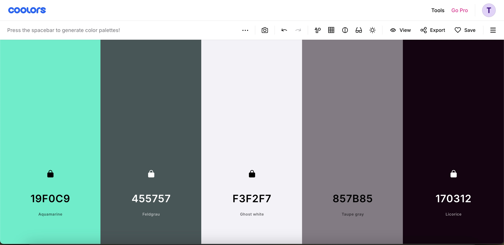

## Heuristic Evaluation

My wireframe 

### Usability

 

##### 1. Discoverability

Ironically, I'll be removing the discover button to improve discoverability. Instead, I want to include filtering on the home page so that users can search directly from the main feed. I'd like a minimalist approach to the content feed, and to not have users navigating to different pages to find what they're looking for.

##### 2. Pleasantness

The key to pleasantness with regards to my app lies in its simplicity. I don't want to overburden the user with too much information or flashing lights or confusing gadgets. A critic may say my app is too simple. I say that critic is a moron. 

### Physical

 

##### 1. Gestalt principles

My wireframe adheres to several Gestalt principles. I asked my friend if I should press shift + F4 to close a program. He said, "don't press shift, Gestalt."

##### 2. Situational context

I'd like the home feed to be distinctly different from the user's profile view. This will help to separate a user's goals of looking back at what they've enjoyed themselves and the more social discovery aspect of interacting with the community's content feed. I'm planning to have posts on the home page be right-aligned and posts on a user's page to be left-aligned.

### Linguistic

 

##### 1. Consistency

Consistency is the name of the game. Enny is nothing if not consistent.

##### 2. Information scent

Smell that? It smells like information. Enny is an olfactory paradise. If you like the smell of information, just follow your nose and you will not be disappointed with where your intuition takes you.

## Visual Design Study

#### Color Palettes

 

My goal for a color scheme was to find colors that were aesthetically pleasing but that also conveyed a sense of calm in order to induce creativity. I borrowed inspiration from a variety of sources and then used Coolors to find colors that further complemented the mint/green theme.

#### Typography

My basis for Enny's1 logo was the old-timey theater vibe that has often displayed a showing in cursive. I used Google Fonts to find something that reminded me of that entertainment theme. For the rest of the app's text I wanted a font that seemed casual and that looked like it belonged in a journal or diary. 

1 Trademark

## Deployment Links

[Github repo](https://github.com/BouncyBabylons/a5_frontend_starter)

[Vercel deployment](https://a5-frontend-starter-git-main-bouncybabylons-projects.vercel.app/)  
*issues here ugh why does it work locally but not on Vercel???
