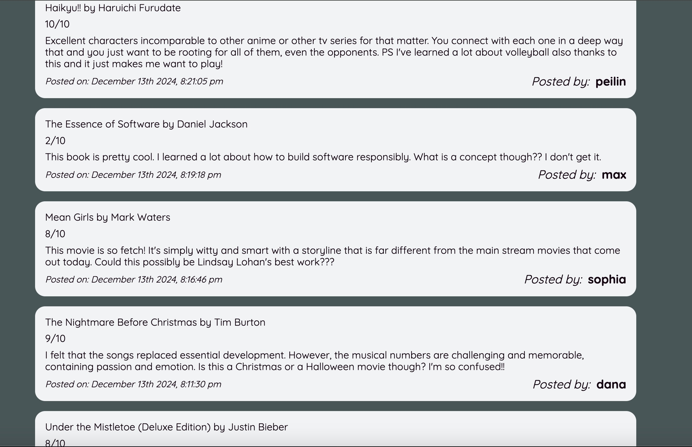

# Assignment 6

## Prepopulated Data

## Task List

| Task          | Instruction   | Rationale     |
| ------------- | ------------- | ------------- |
| 1. **Register** | Create an account for yourself | This is the first thing a user will need to do if they want to contribute content and not just lurk. |
| 2. **Who Dat** | Navigate to your profile page | One of the intended use cases is for Enny to act as a digital diary for your entertainment escapades, so it's important that the act of navigating to your profile to see what you've posted in the past is intuitive and accessible. |
| 3. **Review** | Create a post about some piece of entertainment you've consumed recently and review it | This posting functionality is the essence of what Enny is. I want to be sure that this action is as straightforward as possible. |
| 4. **Edit** | Edit your post to make your review even more descriptive | Users are allowed to change their mind over time. Besides just editing a post, they may even want to delete it completely and forget it ever happened. |
| 5. **Comment** | Add a comment to another user's post | What is a social media app if it doesn't include the ability to interact with other users? Though Enny takes an non-traditional approach to the comment feature, it's still the best way to give your friend an "atta-boy". That the comment feature is not currently working doesn't really matter. Someone can learn very much about another person, and about life itself, by asking them to do the impossible. |

## Study Reports

### Sarah  

The user immediately remarked on how "inviting" the interface of Enny felt. Asked to expand and explain why, she reported that the font and color palette were cozy, "like I'm writing in my middle school diary". The first task was straightforward, in part because Enny's registration process works just like every other website. It was nice to get that validation, though. The user appreciated the welcome message upon registering. The user thought the post form was quite large and suggested pop-up functionality. The user was sad when seeing she didn't have any posts of her own. Upon reflection, I think it would be useful to add some kind of logic that encourages a user to make a post if they don't already have one. The user did not like task #4 and pontificated that life does not have an edit button. It's a neat idea to consider, but I think I'll edit functionality is useful for the time being. 

### Regina

The second user also very much appreciated the colorway of Enny. The user remarked, "This is so cool I would actually use this!" I asked the user, "Please, will you just say a few negative things about it? I need content for my assignment." The user replied, "I would never say anything negative about you. You're my son and you're perfect." I replied, "Mom you're not saying something negative about me... you're saying something negative about the thing I built." The user replied, "The settings page was pretty unimpressive."

## Design Opportunities

*Opportunity 1:*  moderate; physical; the ability/obligation to add pictures to a post would improve how exciting and addicting Enny is. Right now, the app is mostly text-based. I think allowing for pictures to be attached to a post (in the form of a book cover, album cover, movie poster, etc.) would allow for a richer experience.

*Opportunity 2:*  critical; conceptual; it seems like the original developer ran out of time to implement frontend functionality for the comment feature. A comment button and form exists, but it doesn't actually work.  

*Opportunity 3:*  critical; conceptual; future Enny developers would do well to implement frontend functionality for the recommendation feature. Users were frustrated when told to recommend their entertainment unit to somebody else and being unable to do so. Maybe this could be an IAP project for some aspirational intern?